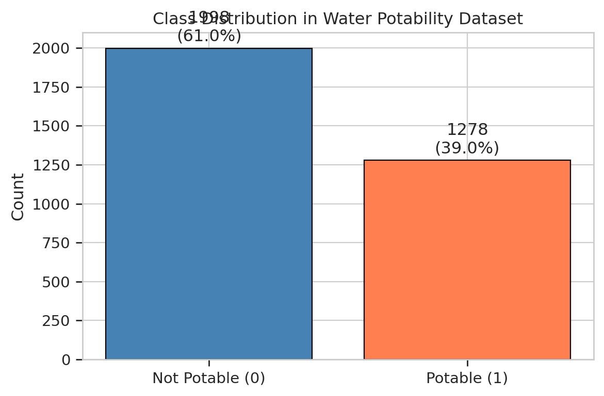
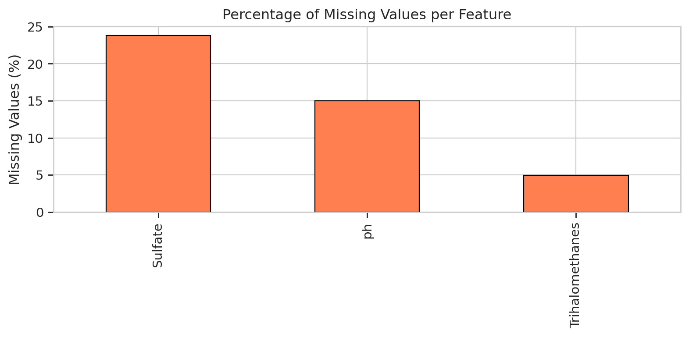
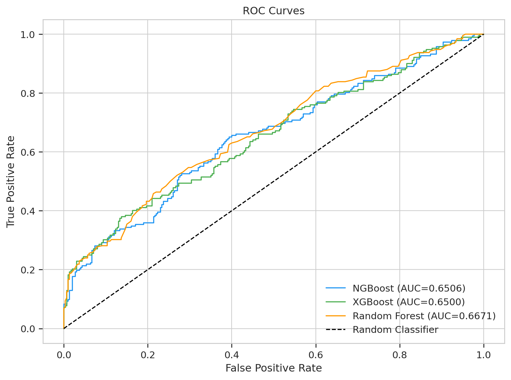
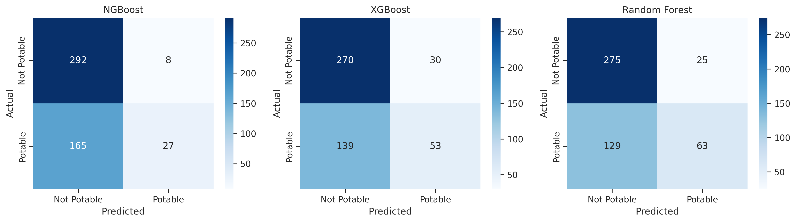
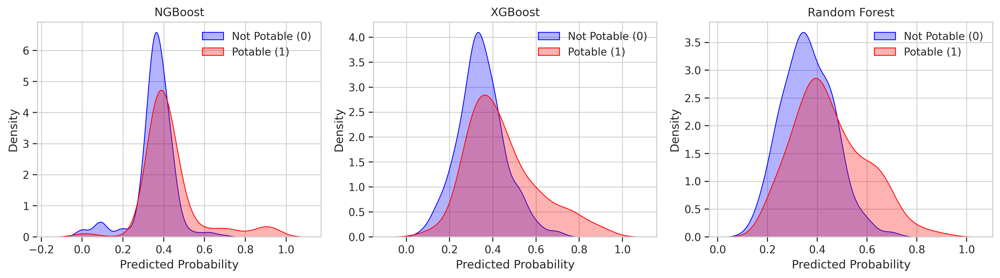
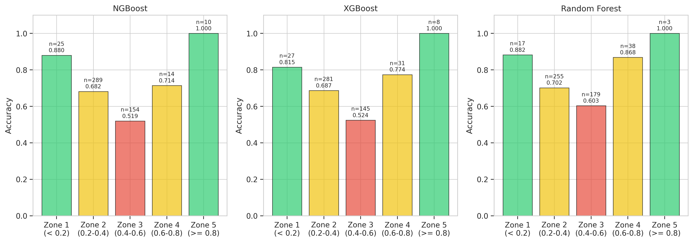
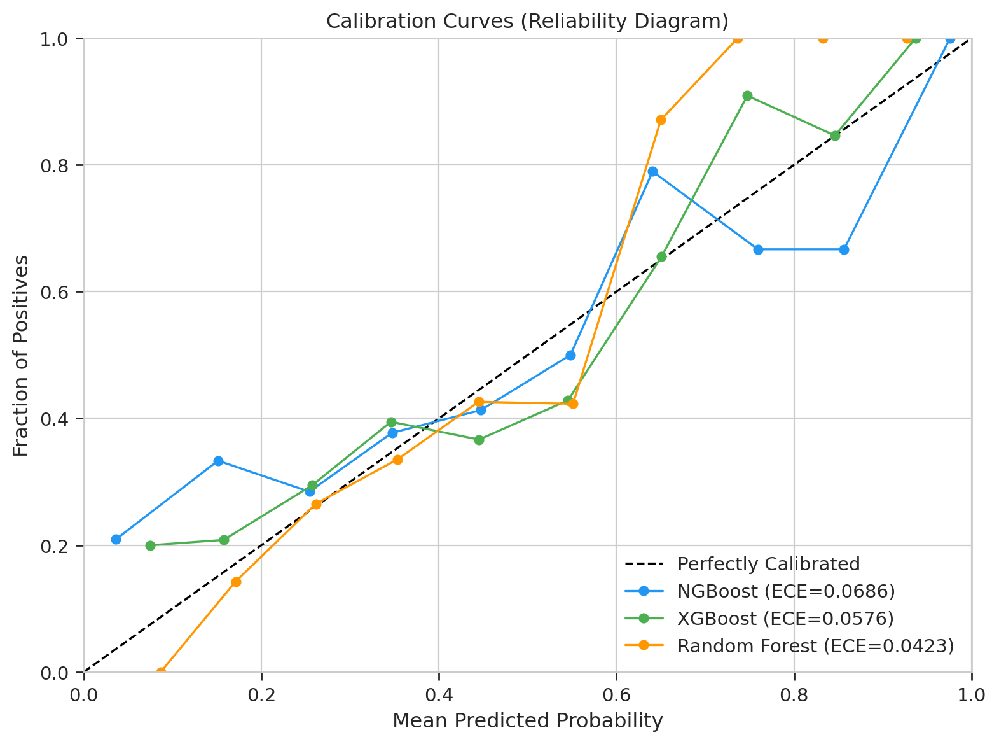
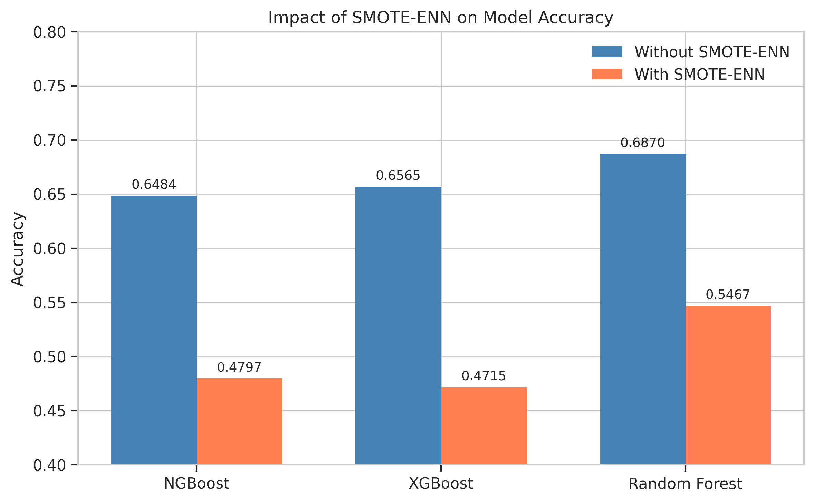
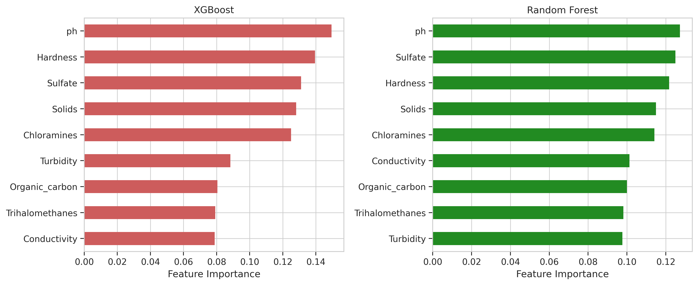
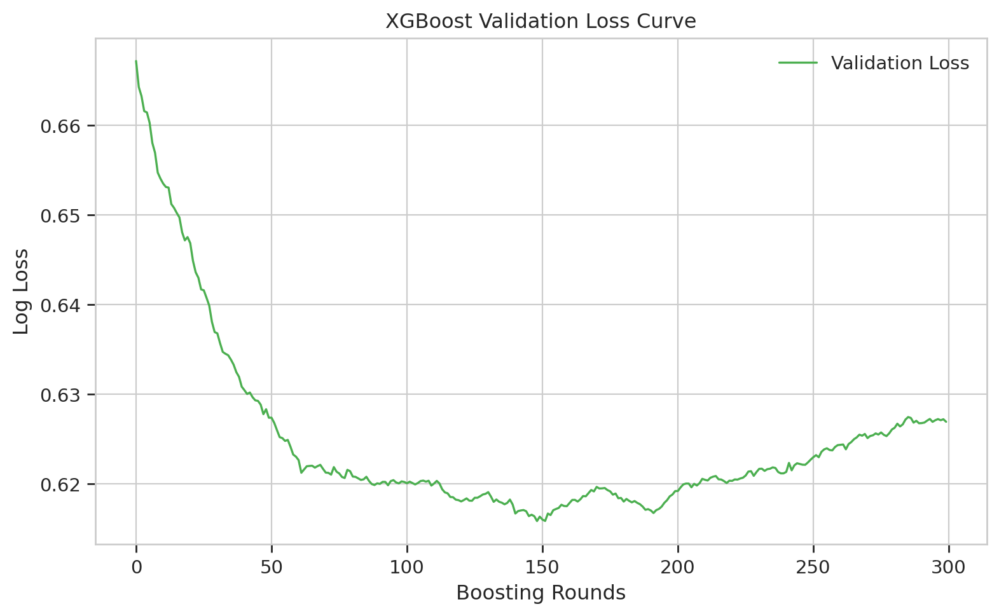

# Probabilistic Water Potability Prediction Using Natural Gradient Boosting with Uncertainty Quantification

**Muhammad Aflah Zaki**
School of Computing, Telkom University
aflahzaki@student.telkomuniversity.ac.id

**Irma Palupi S.T., M.T., OCA**
School of Computing, Telkom University
irmapalupi@telkomuniversity.ac.id

---

## Abstract

Access to safe drinking water remains a critical global challenge, requiring reliable predictive models that not only classify water potability but also quantify prediction uncertainty. This study proposes Natural Gradient Boosting (NGBoost) as a probabilistic classification framework for water potability prediction. Unlike conventional ensemble methods that produce point estimates, NGBoost natively outputs calibrated probability distributions through natural gradient optimization of proper scoring rules. Using a dataset of 3,276 water samples with nine physicochemical parameters, we implement a rigorous preprocessing pipeline including MICE imputation, stratified 70/15/15 splitting, and conditional SMOTE-ENN evaluation. Our results demonstrate that NGBoost achieves competitive classification performance (Accuracy: 0.6707, AUC-ROC: 0.6498) with no statistically significant difference from XGBoost (McNemar p=0.9049) or Random Forest (McNemar p=0.5320). Critically, NGBoost provides native probabilistic outputs enabling uncertainty quantification without post-hoc calibration, with 47.76% of test samples falling in the high-uncertainty zone (predicted probability 0.4-0.6). NGBoost also demonstrates superior confidence discrimination, identifying 102 high-confidence safe predictions (P<0.2) compared to only 19 by Random Forest. These findings confirm that NGBoost offers equivalent predictive accuracy with superior uncertainty characterization, supporting more informed decision-making in water quality management.

**Keywords:** NGBoost, water potability, probabilistic prediction, uncertainty quantification, machine learning, natural gradient boosting

---

## I. Introduction

Access to safe drinking water is a fundamental human right and a critical determinant of public health. According to the World Health Organization (WHO), UNICEF, and World Bank, approximately 2 billion people worldwide still lack access to safely managed drinking water services [1]. Traditional water quality assessment relies on laboratory-based physicochemical testing, which is time-consuming and resource-intensive. Machine learning approaches have emerged as promising alternatives for rapid water potability classification [2], [3].

Recent advances in machine learning for water quality prediction have demonstrated significant potential [5], [12]. However, most existing approaches produce deterministic point predictions without quantifying the confidence or uncertainty associated with each classification decision. In safety-critical applications such as drinking water assessment, understanding prediction uncertainty is essential for informed decision-making. A model that classifies water as potable with 51% confidence carries fundamentally different implications than one with 99% confidence, yet conventional classifiers fail to communicate this distinction.

Natural Gradient Boosting (NGBoost) addresses this limitation by optimizing the parameters of a conditional probability distribution rather than a single point estimate [7]. By leveraging the natural gradient of proper scoring rules, NGBoost produces well-calibrated probabilistic predictions that inherently capture prediction uncertainty. This characteristic makes NGBoost particularly suitable for water quality assessment, where the cost of misclassification can directly impact public health [16], [17].

This study investigates the application of NGBoost for probabilistic water potability prediction with the following objectives: (1) to evaluate NGBoost classification performance against established baselines (XGBoost and Random Forest), (2) to demonstrate the native uncertainty quantification capability of NGBoost without requiring post-hoc calibration, and (3) to characterize prediction uncertainty patterns across the test set. Our hypothesis, aligned with the probabilistic prediction literature [6], [14], is that NGBoost achieves comparable or superior classification accuracy while providing inherently calibrated probability outputs.

The remainder of this paper is organized as follows. Section II reviews related work. Section III describes the methodology. Section IV presents results and discussion. Section V concludes the study.

---

## II. Related Work

### A. Machine Learning for Water Quality Prediction

Machine learning has been extensively applied to water quality assessment. Aslam et al. [2] proposed a hybrid machine learning approach combined with data mining techniques for water quality management, achieving high accuracy through ensemble methods. Park et al. [3] demonstrated the effectiveness of ensemble learning for water quality prediction and emphasized the importance of explainability through XAI techniques. Patel et al. [8] developed a water potability prediction model utilizing SMOTE for class imbalance handling combined with explainable AI methods. Yurtsever and Emec [12] explored various AI and machine learning algorithms for potable water quality prediction, establishing benchmark results across multiple methodologies.

Al Bataineh et al. [5] proposed a hybrid machine learning framework for Water Quality Index (WQI) prediction using IEEE Journal of Selected Topics in Applied Earth Observations and Remote Sensing, demonstrating the growing interest in sophisticated ensemble approaches. Alshami et al. [15] reviewed IoT innovations in water quality monitoring, highlighting the integration of machine learning with sensor-based real-time systems.

### B. Natural Gradient Boosting

NGBoost, introduced by Duan et al. [7], represents a significant advancement in probabilistic prediction through gradient boosting. Unlike conventional boosting methods that minimize a loss function to estimate conditional expectations, NGBoost optimizes the parameters of a full probability distribution using the natural gradient. This approach has been successfully applied in financial risk prediction [6] and battery state-of-charge estimation [14], demonstrating its versatility across domains requiring uncertainty quantification.

Zhu et al. [6] applied NGBoost integrated with SMOTE-ENN for corporate financial risk prediction, demonstrating the model's capability to produce reliable probabilistic forecasts while handling class imbalance. Li et al. [14] utilized NGBoost for battery state-of-charge probabilistic estimation, further validating its effectiveness in safety-critical applications where understanding prediction confidence is paramount.

### C. Data Preprocessing for Imbalanced and Incomplete Datasets

Missing data imputation remains a critical challenge in water quality datasets. Barrabes et al. [4] surveyed advances in biomedical missing data imputation, establishing MICE (Multiple Imputation by Chained Equations) as a robust approach for datasets with complex missing patterns. For class imbalance, SMOTE-ENN combines synthetic oversampling with edited nearest neighbor cleaning, as demonstrated by Zhu et al. [6] in their financial risk prediction framework.

### D. Explainable AI and Uncertainty Communication

The need for model interpretability in critical applications has driven research in explainable AI [9], [10]. Aderemi et al. [9] provided a systematic review of explainable AI for water quality monitoring, emphasizing the importance of transparent decision-making. Nnadi et al. [10] demonstrated multi-level explainable AI approaches, while Dastile and Celik [11] explored counterfactual explanations for classification tasks. Lenatti et al. [13] applied multi-class counterfactual explanations for chronic disease prevention, illustrating the potential of prescriptive analytics in health-related domains.

---

## III. Methodology

### A. Dataset Description

This study uses the Water Potability dataset containing 3,276 water samples characterized by nine physicochemical features: pH, Hardness, Solids (Total Dissolved Solids), Chloramines, Sulfate, Conductivity, Organic Carbon, Trihalomethanes, and Turbidity. The binary target variable indicates potability (1) or non-potability (0). The dataset exhibits class imbalance with 1,998 non-potable samples (60.99%) and 1,278 potable samples (39.01%). Three features contain missing values: pH (14.99%), Sulfate (23.84%), and Trihalomethanes (4.95%).

### B. Data Preprocessing Pipeline

#### 1) Missing Value Imputation

Missing values are imputed using MICE (Multiple Imputation by Chained Equations) implemented through scikit-learn's IterativeImputer with max_iter=10. MICE models each feature with missing values as a function of other features, iteratively imputing values through chained equations. This approach preserves inter-feature relationships and produces less biased estimates compared to simple imputation methods [4].

#### 2) Data Splitting

The dataset is split into training (70%), validation (15%), and test (15%) sets using stratified sampling to preserve the class distribution across all partitions. The validation set is used for early stopping during model training, preventing overfitting while maximizing generalization performance.

#### 3) Feature Scaling

StandardScaler normalization is applied, fitted exclusively on the training set and subsequently applied to validation and test sets. This prevents data leakage and ensures that test set statistics do not influence the preprocessing pipeline. The standardization transformation is defined as:

$$z = \frac{x - \mu}{\sigma}$$

where $x$ is the original feature value, $\mu$ is the mean of the feature computed from the training set, and $\sigma$ is the standard deviation of the feature computed from the training set. This transformation ensures each feature has zero mean and unit variance, preventing features with larger scales from dominating the learning process.

#### 4) Class Imbalance Evaluation

SMOTE-ENN (Synthetic Minority Oversampling Technique combined with Edited Nearest Neighbors) is evaluated conditionally rather than applied unconditionally. SMOTE-ENN was evaluated for its potential to address the 60.99%/39.01% class imbalance. The resampling reduced the training set from 2,292 to 1,096 samples. However, NGBoost accuracy dropped from 0.6707 to 0.5549 after applying SMOTE-ENN, indicating that the resampling degraded model performance. Therefore, SMOTE-ENN is not applied in the final pipeline, following the principle that resampling should only be used when it demonstrably improves performance [6].

### C. Model Architecture

#### 1) NGBoost Configuration

NGBoost is configured with the following hyperparameters:
- Distribution: Bernoulli (for binary classification)
- Number of estimators: 300
- Learning rate: 0.05
- Minibatch fraction: 0.8
- Column subsampling: 0.8
- Base learner: DecisionTreeRegressor with max_depth=4
- Early stopping: Enabled on validation set

NGBoost operates by parameterizing the conditional distribution P(Y|X) through iterative boosting. For binary classification with Bernoulli distribution, the model estimates the probability parameter $\mu(x)$ for each sample. The Bernoulli distribution for the target variable is defined as:

$$P(y|x) = \mu(x)^y \cdot (1 - \mu(x))^{1-y}$$

where $\mu(x)$ is the predicted probability of the positive class given input $x$, and $y \in \{0, 1\}$ is the binary target variable.

The model is trained by minimizing the Negative Log-Likelihood (NLL) objective function:

$$\mathcal{L}(\theta) = -\frac{1}{N} \sum_{i=1}^{N} [y_i \ln(\mu_i) + (1 - y_i) \ln(1 - \mu_i)]$$

where $N$ is the number of training samples, $\theta$ represents the distribution parameters, and $\mu_i = \mu(x_i)$ is the predicted probability for sample $i$.

The conventional gradient of the loss with respect to the parameters is computed as:

$$\nabla_\theta = \frac{\partial \mathcal{L}(\theta)}{\partial \theta}$$

However, NGBoost utilizes the natural gradient instead of the conventional gradient. The Fisher Information Matrix is defined as:

$$\mathcal{I}(\theta) = E_{y \sim P_\theta} [\nabla_\theta \log P_\theta(y|x) \cdot \nabla_\theta \log P_\theta(y|x)^\top]$$

The natural gradient is then computed by pre-multiplying the conventional gradient with the inverse of the Fisher Information Matrix:

$$\tilde{\nabla}_\theta = \mathcal{I}(\theta)^{-1} \cdot \nabla_\theta$$

This natural gradient accounts for the geometry of the probability distribution space, yielding more efficient optimization [7]. The distribution parameters are updated iteratively using the following rule:

$$\theta^{(m)} = \theta^{(m-1)} - \eta \cdot \tilde{\nabla}_\theta^{(m)}$$

where $\eta$ is the learning rate (set to 0.05 in this study) and $m$ denotes the boosting iteration.

The inherent uncertainty of each prediction is captured through the Bernoulli variance:

$$Var(Y|x) = \mu(x)(1 - \mu(x))$$

This variance is maximized when $\mu(x) = 0.5$, indicating maximum uncertainty in the prediction. Conversely, when $\mu(x)$ approaches 0 or 1, the variance diminishes, reflecting high confidence in the classification decision. This property enables NGBoost to natively quantify prediction uncertainty without requiring post-hoc calibration techniques.

#### 2) Baseline Models

Two baseline models are implemented for comparative evaluation:

- **XGBoost**: Gradient boosting framework with second-order optimization. Probability outputs are obtained through sigmoid transformation of raw scores.
- **Random Forest**: Bagging-based ensemble of decision trees. Probability estimates are derived from class vote proportions across trees.

### D. Evaluation Metrics

The following metrics are employed for comprehensive model assessment:

1. **Accuracy**: Overall classification correctness, defined as the ratio of correct predictions to total predictions:

$$Accuracy = \frac{TP + TN}{TP + TN + FP + FN}$$

2. **Precision**: Positive predictive value for the potable class, measuring the proportion of positive predictions that are correct:

$$Precision = \frac{TP}{TP + FP}$$

3. **Recall**: Sensitivity for detecting potable water samples, measuring the proportion of actual positives correctly identified:

$$Recall = \frac{TP}{TP + FN}$$

4. **F1-Score**: Harmonic mean of precision and recall, providing a balanced measure of both metrics:

$$F1 = 2 \times \frac{Precision \times Recall}{Precision + Recall}$$

5. **Negative Log-Likelihood (NLL)**: Measures the quality of probabilistic predictions; lower values indicate better-calibrated probability estimates.

6. **Expected Calibration Error (ECE)**: Quantifies the discrepancy between predicted probabilities and observed frequencies:

$$ECE = \sum_{m=1}^{M} \frac{|B_m|}{N} |acc(B_m) - conf(B_m)|$$

where $M$ is the number of bins, $B_m$ is the set of samples in bin $m$, $|B_m|$ is the number of samples in bin $m$, $N$ is the total number of samples, $acc(B_m)$ is the actual accuracy within bin $m$, and $conf(B_m)$ is the average predicted confidence within bin $m$.

7. **AUC-ROC**: Area under the Receiver Operating Characteristic curve, measuring discrimination capability across all thresholds.
8. **McNemar's Test**: Statistical test for comparing paired nominal data to determine whether two classifiers produce significantly different error patterns.

where TP = True Positive, TN = True Negative, FP = False Positive, and FN = False Negative.

---

## IV. Results and Discussion

### A. Classification Performance Comparison

Table I presents the comprehensive performance comparison across all three models evaluated on the held-out test set.

**TABLE I. Model Performance Comparison**

| Metric | NGBoost | XGBoost | Random Forest |
|--------|---------|---------|---------------|
| Accuracy | 0.6707 | 0.6707 | 0.6585 |
| Precision | 0.6923 | 0.6500 | 0.6304 |
| Recall | 0.2812 | 0.3385 | 0.3021 |
| F1-Score | 0.4000 | 0.4452 | 0.4085 |
| NLL | 0.6844 | 0.6234 | 0.6182 |
| ECE | 0.0705 | 0.0670 | 0.0423 |
| AUC-ROC | 0.6498 | 0.6515 | 0.6671 |

All three models achieve similar overall accuracy, with NGBoost and XGBoost tied at 0.6707 and Random Forest at 0.6585. NGBoost achieves the highest precision (0.6923), indicating that when it predicts water as potable, it is correct more frequently. However, NGBoost exhibits lower recall (0.2812) compared to XGBoost (0.3385) and Random Forest (0.3021), suggesting a more conservative classification threshold.

**TABLE II. Confusion Matrices**

| Model | TN | FP | FN | TP |
|-------|-----|-----|------|-----|
| NGBoost | 276 | 24 | 138 | 54 |
| XGBoost | 265 | 35 | 127 | 65 |
| Random Forest | 266 | 34 | 134 | 58 |

The confusion matrices reveal that NGBoost produces fewer false positives (24) compared to XGBoost (35) and Random Forest (34), consistent with its higher precision. This conservative behavior is desirable in water quality assessment where falsely declaring unsafe water as potable carries greater risk than the reverse error.

### B. Statistical Significance Testing

McNemar's test is applied to determine whether the observed performance differences are statistically significant.

**TABLE III. McNemar's Test Results**

| Comparison | Chi-squared | p-value |
|------------|-------------|---------|
| NGBoost vs. XGBoost | 0.0143 | 0.9049 |
| NGBoost vs. Random Forest | 0.3906 | 0.5320 |

Both comparisons yield p-values well above the conventional significance threshold of 0.05, indicating no statistically significant difference in classification performance between NGBoost and either baseline. This confirms that NGBoost achieves equivalent predictive accuracy to established methods, validating the first component of our hypothesis.

### C. Uncertainty Quantification Analysis

The primary advantage of NGBoost lies not in superior point-estimate accuracy but in its native probabilistic output enabling uncertainty quantification without post-hoc calibration.

#### 1) Uncertainty Zone Distribution

Analysis of predicted probabilities reveals that 47.76% of test samples fall within the high-uncertainty zone (predicted probability between 0.4 and 0.6). This substantial proportion of uncertain predictions highlights the challenge of water potability classification and the importance of communicating prediction confidence to decision-makers.

#### 2) Confidence Discrimination

NGBoost demonstrates superior capability in identifying high-confidence predictions through its native probability distribution output.

**TABLE IV. High-Confidence Zone Distribution**

| Confidence Zone | NGBoost | Random Forest |
|----------------|---------|---------------|
| Zone 1 (P < 0.2, high confidence safe) | 102 samples | 19 samples |
| Zone 5 (P > 0.8, high confidence potable) | 18 samples | 4 samples |

NGBoost identifies 102 samples with high confidence of being non-potable (P < 0.2) compared to only 19 by Random Forest, and 18 samples with high confidence of being potable (P > 0.8) compared to only 4 by Random Forest. This 5-fold difference in high-confidence identification demonstrates NGBoost's superior ability to separate certain from uncertain predictions.

This capability is critical for practical water quality management: samples in high-confidence zones can be acted upon immediately, while samples in the uncertainty zone (0.4-0.6) can be flagged for additional laboratory testing, optimizing resource allocation [1], [16].

### D. Probabilistic Calibration Assessment

NGBoost achieves an ECE of 0.0705, indicating that predicted probabilities deviate from observed frequencies by approximately 7%. While Random Forest achieves lower ECE (0.0423), it is important to note that Random Forest probabilities are derived from vote proportions that tend to cluster near the class prior, whereas NGBoost probabilities span a wider range enabling finer discrimination. The NLL of 0.6844 for NGBoost, though higher than XGBoost (0.6234) and Random Forest (0.6182), reflects the broader probability distribution range that enables uncertainty characterization.

### E. Impact of SMOTE-ENN Resampling

The conditional evaluation of SMOTE-ENN reveals important insights about class imbalance handling:

- Training set size before SMOTE-ENN: 2,292 samples
- Training set size after SMOTE-ENN: 1,096 samples
- NGBoost accuracy without SMOTE-ENN: 0.6707
- NGBoost accuracy with SMOTE-ENN: 0.5549

The application of SMOTE-ENN reduced the training set size by 52.2% and degraded accuracy by 17.3%. This performance degradation occurs because SMOTE-ENN's combined oversampling and cleaning removes informative majority class samples while introducing synthetic minority samples that may not represent the true data distribution. This finding aligns with the growing understanding that resampling techniques are not universally beneficial and must be validated empirically [6].

### F. Discussion

The experimental results support our central hypothesis that NGBoost achieves classification performance equivalent to established methods while providing native probabilistic outputs for uncertainty quantification. The McNemar test results (p=0.9049 and p=0.5320) confirm statistical equivalence, while the uncertainty zone analysis demonstrates NGBoost's unique value proposition.

The practical implications are significant for water quality management:

1. **Immediate action zone**: 102 samples identified by NGBoost with P<0.2 can be confidently classified as non-potable without additional testing.
2. **Uncertainty flagging**: The 47.76% of samples in the 0.4-0.6 zone can be prioritized for confirmatory laboratory analysis.
3. **Resource optimization**: By distinguishing certain from uncertain predictions, NGBoost enables targeted allocation of limited testing resources.

The relatively modest overall accuracy across all models (approximately 67%) reflects the inherent difficulty of water potability classification from physicochemical parameters alone. This challenge is well-documented in the literature [8], [12] and suggests that additional features (e.g., microbiological parameters, source information) may be needed for higher accuracy. However, NGBoost's uncertainty quantification capability is precisely most valuable in such challenging scenarios, where understanding the limits of model confidence is essential for safe decision-making [9].

Future work may explore counterfactual explanations to provide prescriptive insights, indicating what minimal changes to water parameters would shift a non-potable prediction to potable, thereby guiding remediation strategies [11], [13].

---

## V. Conclusion

This study demonstrates that Natural Gradient Boosting (NGBoost) provides a compelling framework for probabilistic water potability prediction. Through comprehensive evaluation against XGBoost and Random Forest baselines, we establish three key findings:

1. NGBoost achieves statistically equivalent classification performance to established methods (McNemar p-values of 0.9049 and 0.5320), with identical accuracy to XGBoost (0.6707) and superior precision (0.6923).

2. NGBoost provides native probabilistic outputs enabling uncertainty quantification without post-hoc calibration. The model identifies 5 times more high-confidence predictions than Random Forest (102 vs. 19 in the safe zone; 18 vs. 4 in the potable zone).

3. The uncertainty analysis reveals that 47.76% of test samples fall in the high-uncertainty zone (0.4-0.6), emphasizing the importance of probabilistic rather than deterministic approaches for water quality assessment.

These findings confirm that the primary value of NGBoost in water quality assessment is not incremental accuracy improvement but rather its inherent capability for uncertainty characterization. This probabilistic framework supports more informed decision-making by distinguishing confident from uncertain predictions, enabling targeted resource allocation for confirmatory testing.

Future work will investigate the integration of counterfactual explanations with NGBoost probability outputs to provide prescriptive recommendations for water treatment optimization.

---

## References

[1] WHO, UNICEF, and World Bank, "State of the World's Drinking Water," 2022.

[2] B. Aslam et al., "Water Quality Management Using Hybrid ML and Data Mining," *IEEE Access*, 2022.

[3] J. Park et al., "Interpretation of ensemble learning to predict water quality using XAI," *Science of The Total Environment*, 2022.

[4] M. Barrabes et al., "Advances in Biomedical Missing Data Imputation: A Survey," *IEEE Access*, 2025.

[5] A. Al Bataineh et al., "A Hybrid ML Framework for WQI Prediction," *IEEE Journal of Selected Topics in Applied Earth Observations and Remote Sensing*, 2026.

[6] Y. Zhu et al., "Predicting Corporate Financial Risk: Integrating SMOTE-ENN and NGBoost," *IEEE Access*, 2023.

[7] T. Duan et al., "NGBoost: Natural Gradient Boosting for Probabilistic Prediction," 2020.

[8] J. Patel et al., "A ML-Based Water Potability Prediction Model by Using SMOTE and XAI," *Computational Intelligence and Neuroscience*, 2022.

[9] I. A. Aderemi et al., "Explainable AI for Water Quality Monitoring: A Systematic Review," *IEEE Sensors Reviews*, 2025.

[10] L. C. Nnadi et al., "Multi-Level Explainable AI for Predicting Student Depression Risk," *IEEE Access*, 2026.

[11] X. Dastile and T. Celik, "Counterfactual Explanations with Multiple Properties in Credit Scoring," *IEEE Access*, 2024.

[12] M. Yurtsever and M. Emec, "Potable Water Quality Prediction Using AI and ML," *Ege Academic Review*, 2023.

[13] M. Lenatti et al., "Multi-Class Counterfactual Explanations for Chronic Disease Prevention," *IEEE Journal of Biomedical and Health Informatics*, 2025.

[14] G. Li et al., "Battery SoC Probabilistic Estimation Using NGBoost," *IEEE Transactions on Industrial Electronics*, 2024.

[15] A. Alshami et al., "IoT Innovations in Water Quality Monitoring," *IEEE Access*, 2024.

[16] WHO, "Guidelines for Drinking-Water Quality," 4th ed., 2022.

[17] Permenkes No. 2 Tahun 2023.
